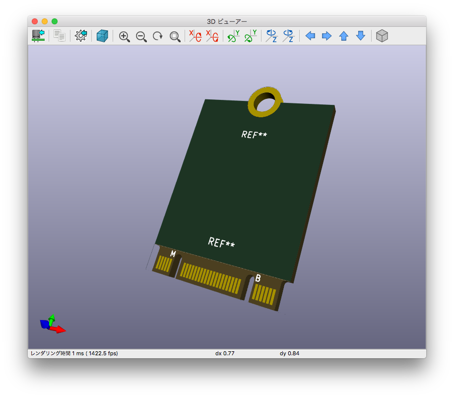
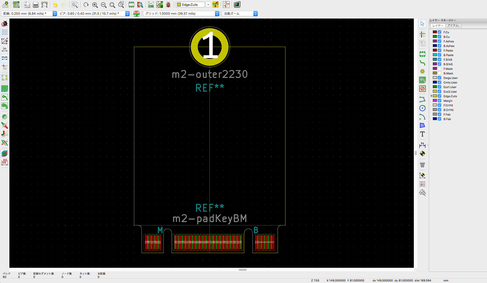

# KiCad Library for m.2 NGFF card

## Explanation
This library targets to design for m.2 (NGFF) card.
Our objective is expanding PC device for using robotics or so on as freely.
And a main idea is stimulated [KiCad Mini PCI Express (mPCIe) Library](https://github.com/mithro/kicad-mini-pci-express).

Library includes only module footprints, however schematics may be scheduled to add.

This repository applied MIT license, which have no guarantee for any damage to use.
As your caution, M.2 specification is published by [PCI-SIG](https://pcisig.com/).
You would like to get information precisely, then you should belong to PIC-SIG or buy the M.2 Specification paper.

Use for your making.

#### Thanks for reading
It is very rough English such that I know.
If this readme has a mistake for a sentence or is against a rule, please tell me.

## Sample picture

